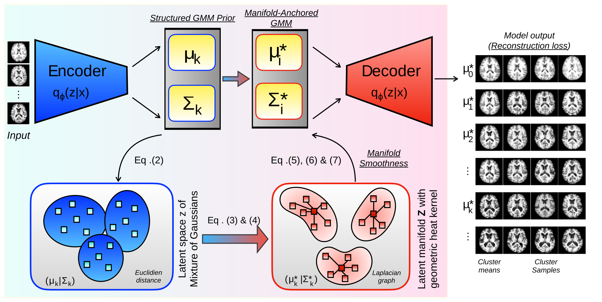

# Deep Medical Image Clustering with Geometric Heat-Kernel Priors

Official implementation for our MICCAI 2026 submission 4033.

> **ABSTRACT**: Unsupervised stratification of medical imaging cohorts can reveal clinically meaningful sub-populations without expert labels, which are often noisy and fail to capture true pathological heterogeneity. However, existing deep clustering methods estimate Gaussian mixture priors via Euclidean averaging, producing centroids that drift off the curved data manifold and suffer from component collapse as the number of clusters grows. We propose a manifold-aware Expectation-Maximization (EM) algorithm whose M-step selects each cluster prototype as the graph medoid with the highest diffusion centrality on a heat-kernel-weighted latent graph, ensuring that every prototype remains on-manifold. A Dirichlet energy regularizer enforces geometric smoothness across cluster boundaries, and a per-cluster uncertainty score enables label-free quality assessment. On cardiac scar and brain MRI benchmarks, our method achieves the highest clustering performance among all compared methods, produces the sharpest prototypes reported to date, and remains stable at large cluster counts where all baselines degenerate.



## Models

| Model | Description | Training Script |
|-------|-------------|-----------------|
| **VAE-GMM** | VAE with Gaussian Mixture Model prior | `train_vae_gmm.py` |
| **Ours** | Clustering with Latent Atlas Selection & Training | `train_ours.py` |
| **Diffusion-VAE** | VAE-GMM + latent-space diffusion denoiser | `train_diffusion.py` |
| **Baseline GMM** | Pixel-space GMM clustering (non-neural) | `train_baseline.py` |
| **Baseline K-Means** | Pixel-space K-Means clustering (non-neural) | `train_baseline.py` |

## Datasets


| Dataset | Classes |
|---------|------|
| MNIST | $10$ digits |
| Cardiac LGE | $\geq 5$ pathologies |
| OASIS Brain MRI | $K \in [8,15]$ clusters |

## Setup

```bash
pip install -r requirements.txt
```

### Download Data and Pre-trained Checkpoints

To reproduce the reported results (e.g., run the evaluation notebooks), download the data and pre-trained checkpoints from OSF:

1. Go to the [OSF repository](https://osf.io/879yr/files/osfstorage?view_only=ee816762b1b74632a65e9eab1fe7a706)
2. Download `data.zip` and `checkpoints.zip`
3. Unzip them into the repository root:
```bash
unzip data.zip -d .
unzip checkpoints.zip -d .
```
This will populate the `data/` and `checkpoints/` directories with the required dataset files and pre-trained model weights.

> **Note:** MNIST auto-downloads on first run via torchvision, so it is not included in `data.zip`. Cardiac and OASIS data are included.

## Training

```bash
# VAE-GMM
python train_vae_gmm.py --config configs/mnist/vae_gmm.yaml
python train_vae_gmm.py --config configs/cardiac/vae_gmm.yaml
python train_vae_gmm.py --config configs/oasis/vae_gmm.yaml

# Ours
python train_ours.py --config configs/mnist/ours.yaml
python train_ours.py --config configs/cardiac/ours.yaml
python train_ours.py --config configs/oasis/ours.yaml

# Diffusion-VAE (two-phase: VAE training then denoiser)
python train_diffusion.py --config configs/mnist/diffusion_vae.yaml
python train_diffusion.py --config configs/cardiac/diffusion_vae.yaml

# Baselines
python train_baseline.py --config configs/mnist/baseline_gmm.yaml
python train_baseline.py --config configs/cardiac/baseline_kmeans.yaml
```

### Common CLI options

All training scripts accept:
```
--config PATH        YAML config file (required)
--output_dir PATH    Override output directory
--epochs N           Override number of epochs
--batch_size N       Override batch size
--lr FLOAT           Override learning rate
--seed INT           Override random seed
--device STR         Override device (cuda/cpu)
```

### Decoder fine-tuning (Ours)

Fine-tune only the decoder for improved reconstruction sharpness:
```bash
python finetune_decoder.py \
    --config configs/oasis/ours.yaml \
    --checkpoint checkpoints/oasis/ours/checkpoint_best.pth \
    --output_dir results/oasis_finetuned/ \
    --loss ssim --epochs 200 --lr 5e-5
```

## Evaluation

```bash
# Supervised datasets (MNIST, Cardiac) - reports accuracy, NMI, ARI
python test.py --config configs/mnist/vae_gmm.yaml \
    --checkpoint checkpoints/mnist/vae_gmm/checkpoint_best.pth \
    --output_dir results/test_mnist_vae_gmm/

# Unsupervised dataset (OASIS) - reports silhouette, CH, DB scores
python test.py --config configs/oasis/ours.yaml \
    --checkpoint checkpoints/oasis/ours/checkpoint_best.pth \
    --output_dir results/test_oasis_ours/

# With MC uncertainty estimation
python test.py --config configs/cardiac/vae_gmm.yaml \
    --checkpoint checkpoints/cardiac/vae_gmm/checkpoint_best.pth \
    --output_dir results/test_cardiac_uncertainty/ \
    --uncertainty --n_mc 30

# Diffusion-VAE (evaluates both raw and denoised latents)
python test.py --config configs/mnist/diffusion_vae.yaml \
    --checkpoint checkpoints/mnist/diffusion_vae/checkpoint_vae.pth \
    --output_dir results/test_mnist_diffusion/
```

### Test outputs

For each run, `test.py` generates:
- `metrics.yaml` - all computed metrics
- `cluster_means.png` - decoded GMM cluster centers
- `reconstructions.png` - input vs reconstruction (neural models)
- `latent_tsne.png` - t-SNE visualization of latent space
- `cluster_purity.csv` - per-cluster label distribution (supervised)
- `uncertainty_heatmap.png` - MC uncertainty maps (if `--uncertainty`)

## Pre-trained Checkpoints

Pre-trained checkpoints are available for download from the [OSF repository](https://osf.io/879yr/files/osfstorage?view_only=ee816762b1b74632a65e9eab1fe7a706) (see [Setup](#setup) for download instructions). After unzipping, the directory structure is:
```
checkpoints/
├── mnist/{vae_gmm,ours,diffusion_vae,baseline_gmm}/
├── cardiac/{vae_gmm,ours,diffusion_vae,baseline_gmm,baseline_kmeans}/
└── oasis/{vae_gmm,ours,diffusion_vae}/
```

Classical baseline models are small and deterministic to refit from their YAML configs. The bundle includes the reported MNIST GMM and cardiac GMM/K-Means baseline checkpoints; MNIST K-Means and OASIS classical baselines are expected to be refit with `train_baseline.py`.

## Project Structure

```
├── train_vae_gmm.py          # VAE-GMM training
├── train_ours.py             # Ours training
├── train_diffusion.py         # Diffusion-VAE training (two-phase)
├── train_baseline.py          # Baseline GMM/K-Means
├── finetune_decoder.py        # Post-training decoder fine-tuning
├── test.py                    # Unified evaluation & visualization
├── models/
│   ├── vae_gmm/               # VAE with GMM prior
│   ├── ours/                  # Ours with atlas generation
│   ├── diffusion_vae/          # VAE-GMM + latent denoiser
│   ├── baseline_gmm/           # Pixel-space GMM
│   └── baseline_kmeans/        # Pixel-space K-Means
├── utils/
│   ├── config.py               # Configuration system
│   ├── data_loader.py          # Dataset loading
│   ├── metrics.py              # Clustering metrics
│   ├── visualization.py        # Plotting utilities
│   ├── atlas_visualization.py  # Atlas & cluster visualization
│   ├── logger.py               # Logging infrastructure
│   └── staged_training.py      # Multi-stage loss scheduling
├── configs/                    # YAML configs per dataset/model
├── data/                       # Dataset files
└── checkpoints/                # Pre-trained model weights
```
